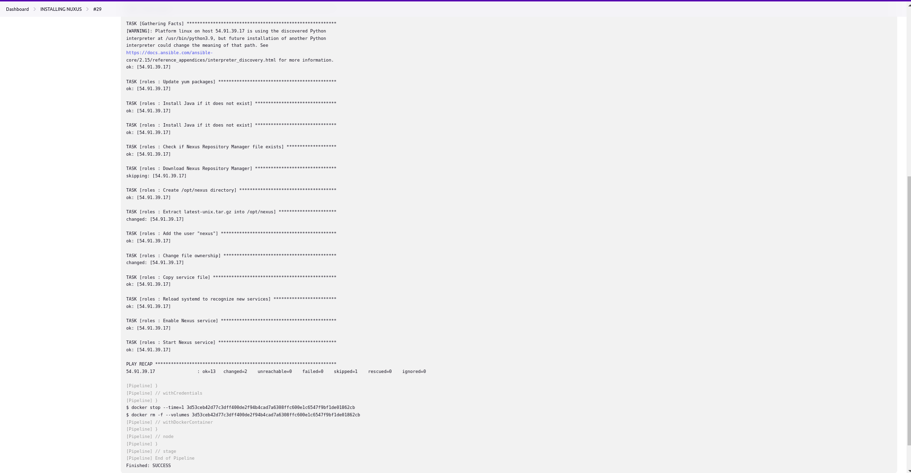
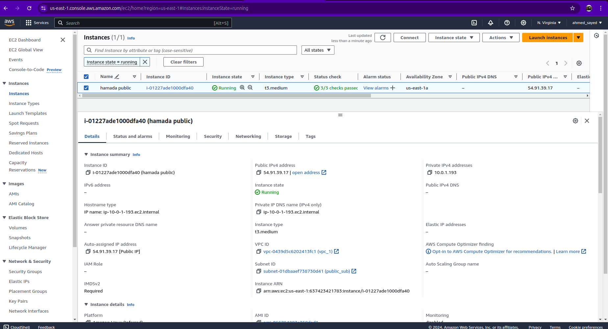
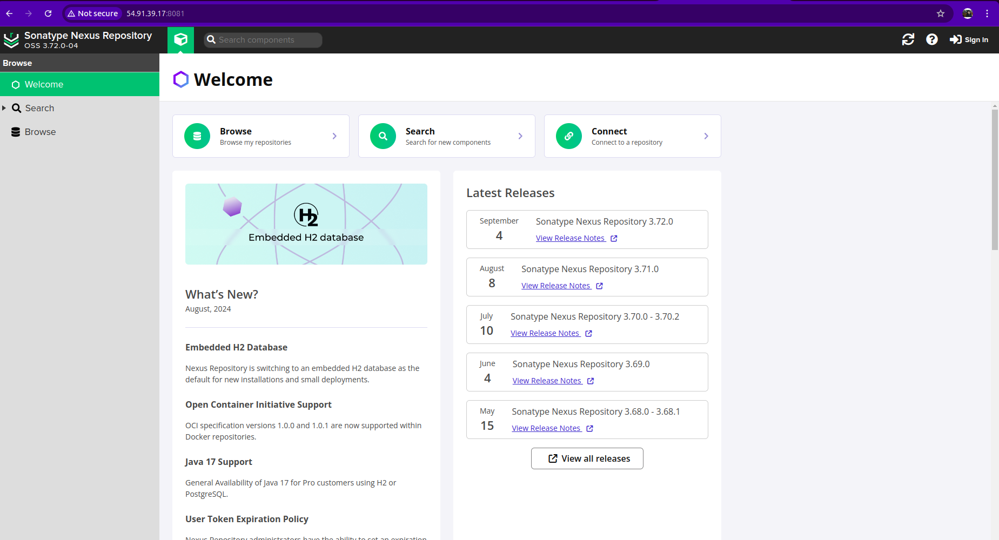
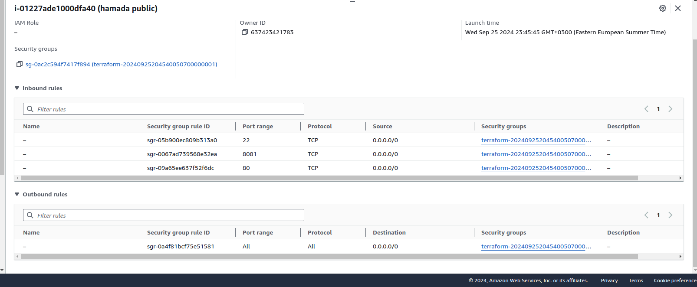

# Integration of Ansible, Jenkins, and Terraform to Install Nexus
This project demonstrates the integration of Ansible, Jenkins, and Terraform to automate the installation of Nexus Repository Manager. The automation simplifies the process of setting up Nexus, enabling efficient management of software artifacts.

## Technologies Used
   - Ansible: For configuration management and application deployment.
   - Jenkins: For Continuous Integration and Continuous Deployment (CI/CD).
   - Docker : For containerization, providing isolated environments for running applications and tools like Terraform and Ansible. 
   - Terraform: For infrastructure as code to provision the necessary resources.
   - Nexus Repository Manager: For managing software artifacts.

## Terraform Configuration
This section outlines the Terraform configuration used to provision the necessary AWS infrastructure, including a Virtual Private Cloud (VPC), subnets, security groups, and EC2 instances.

### VPC Setup
The configuration defines a VPC and related resources as follows:

  1. VPC: A VPC is created with a CIDR block of 10.0.0.0/16.
  2. Subnets: A public subnet (10.0.1.0/24) is created in the specified availability zone.
  3. Internet Gateway: An Internet Gateway is attached to the VPC to allow external access.
  4. Route Tables: A route table is configured to direct traffic from the subnet to the Internet Gateway.
  5. Security Group: A security group is defined to manage access to the EC2 instances, allowing traffic on ports 22 (SSH), 80 (HTTP), and 8081, among others.
     
### EC2 Instance Configuration
The EC2 instances are provisioned with the following specifications:

  - AMI: ami-066784287e358dad1 (replace with your desired AMI ID).
  - Instance Type: t3.medium.
  - Public Subnet: Instances are launched in the public subnet created above.
  - Public IP Address: Instances are assigned a public IP.
## Ansible Configuration

This section describes the Ansible playbook used to automate the installation and configuration of the Nexus Repository Manager on the EC2 instances provisioned in the previous section. The playbook utilizes Ansible roles for better organization and reusability.

### Playbook Overview
The main playbook targets the app group of hosts, which corresponds to the EC2 instances where Nexus will be installed. The tasks are organized into roles, each responsible for specific aspects of the configuration.

### Roles Structure
The roles directory structure is as follows:
- roles/
  - roles/: This directory contains individual role definitions.
     - tasks/: Contains the main tasks for the role.
     - files/: Contains any static files needed, such as the Nexus service file.
    
### Role Breakdown
 1. Update System Packages: The first task updates all installed packages to their latest versions using the yum module.

 2. Install Java: This task installs the required Java versions necessary for running Nexus. 

 3. Download Nexus Repository Manager: This task checks if the Nexus tarball exists in the /home/ec2-user directory. If it does not, the playbook downloads it from the official Sonatype repository.

 4. Create Nexus Directory: A directory is created at /opt/nexus for the Nexus installation.

 5. Extract Nexus: The downloaded Nexus tarball is extracted into the /opt/nexus directory.

 6. Create Nexus User: A system user named nexus is created with restricted shell access, ensuring that the Nexus service runs securely.

 7. Change Ownership: Ownership of the /opt/nexus directory is changed to the nexus user and group for proper permissions.

 8. Configure Nexus as a Service: The Nexus service file is copied from the files directory to /etc/systemd/system/nexus.service, and systemd is reloaded to recognize the new service.

 9. Start Nexus Service: The Nexus service is enabled to start on boot and is immediately started.

### Nexus Service Configuration
The Nexus service is configured to start automatically after a reboot and is set to restart on failure. It runs under the nexus user to maintain security and minimize potential risks.

## Jenkins Pipeline Configuration
This section outlines the Jenkins pipeline configuration used to automate the deployment process, integrating both Terraform and Ansible for installing the Nexus Repository Manager on the EC2 instances.

### Pipeline Overview
The Jenkins pipeline consists of two main stages: cloning the repository and configuring the Nexus installation using Ansible. Each stage runs in a Docker container that has the necessary tools installed.

### Stages Breakdown
#### 1. Clone Repository:
  - This stage uses a Docker container based on a custom image named my_terra, which includes Terraform and other dependencies.
  - It begins by removing any existing instance of the repository and then clones the latest version from GitHub.
  - After cloning, it navigates to the terraform directory to run Terraform commands: init, plan, and apply. This process provisions the necessary infrastructure in AWS.
  - Finally, the stage initializes a new Git repository in the root directory, stages the inventory.txt file generated by Terraform, commits the changes, and pushes them back to the main branch of the GitHub repository.

#### 2. Ansible Configuration:
  - This stage uses another Docker container, my_ansb, which has Python and Ansible installed.
  - Similar to the previous stage, it starts by removing the existing repository and cloning it again.
  - It sets permissions for the private key file (DAY3.pem) and executes the Ansible playbook (nuxus_playbook.yml) using the inventory file generated by Terraform. The playbook deploys and configures the Nexus Repository Manager on the provisioned EC2 instances.
### Docker Agent Configuration
#### Agent 1 (Terraform)
   - Base Image: Ubuntu 20.04
   - Installed Packages: Git, SSH, Curl, Unzip, GnuPG, Software Properties Common, Terraform
   - SSH Configuration: Copies SSH keys and AWS configuration to the container, ensuring the right permissions are set.
   - Git Configuration: Sets global Git user information for committing changes.
#### Agent 2 (Ansible)
   - Base Image: Python 3.9-slim
   - Installed Packages: SSH client, Git, and sshpass for handling SSH connections.
   - Ansible Installation: Installs Ansible via pip.

## Getting Started
To get started with this project, follow these steps:

1. Clone the repository:
```sh
git clone https://github.com/ahmed1958/Integration-of-ansible-Jenkins-terraform-to-install-nuxus.git
cd Integration-of-ansible-Jenkins-terraform-to-install-nuxus
```
2. Ensure you have Docker and Jenkins installed and configured to run the pipeline.
3. Set up your GitHub credentials in Jenkins and configure the necessary credentials for AWS.
4. Build the images from the Dockerfiles:
```sh
docker build -t my_terra ./path/to/terraform/dockerfile
docker build -t my_ansb ./path/to/ansible/dockerfile
```
5. Run the Jenkins Pipeline:

    - Open your Jenkins dashboard. 
    - Create a new pipeline job.
    - Set the pipeline script to point to the Jenkinsfile in the cloned repository.
    - Save the job configuration and trigger a build.
## Expected Output Images

The following images represent the expected outputs at various stages of the deployment process:

<div align="center">


<p> Pipeline Success </p>


<p> EC2 Details </p>


<p> Nexus Home </p>



<p> Security Groups </p>

</div>

## Conclusion
This project demonstrates the effective integration of Ansible, Jenkins, and Terraform to automate the deployment and management of a critical software component, the Nexus Repository Manager, leveraging the power of Infrastructure as Code and Continuous Integration/Continuous Deployment practices.
